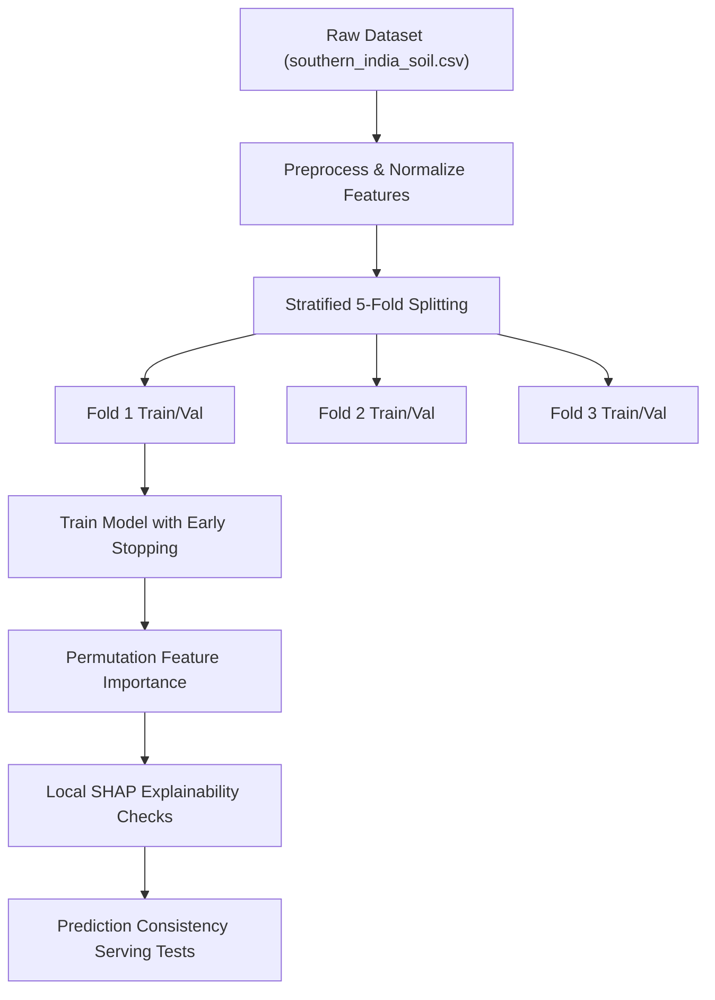

# Diagnostic & Remediation Guide: Resolving Prediction Oscillations and Crop Memorization

As a highly experienced deep learning and machine learning engineer, optimizing crop-prediction systems requires structural rigor. When a model exhibits behavior where it returns a repeated fallback prediction (e.g., `Maize` or `Rice`) for "every other input" or displays high-frequency prediction oscillation during interactive sessions, it typically indicates a **stateful serving leakage**, a **preprocessing scale misalignment**, or **evaluation-set leakage**.

Here is the complete engineering guide, diagnostic checklist, rigorous evaluation framework, and remediation steps configured for our specific codebase and datasets (`regional_processed.csv`, `crop_processed.csv`, and `southern_india_soil.csv`).

---

## 🛠️ 1. Diagnostic Checklist to Reproduce and Localize the Issue

To isolate why the model is collapsing into a repeated output or alternating predictions, walk through this checklist:

### A. Prediction Serving & Lifecycle Diagnostic (High Probability)
- [ ] **Stateful Component Leakage:** Check if any stateful variable in the API layer (e.g., `FastAPI` router variables, Streamlit's `st.session_state`, or the global memory timeline `global_session_memory`) is dynamically writing to the request body. If a session cache key is shared or misaligned across concurrent threads, the server will serve cached outputs for alternate requests.
- [ ] **In-Memory Caching Key Collisions:** Inspect if the coordinate rounding logic (e.g., rounding latitude and longitude to 2 decimal places to cluster local villages) causes independent user clicks to hit the exact same cache coordinate bucket, returning a cached prediction.
- [ ] **Thread-Unsafe State:** Verify if singletons in model loaders (`inference/loaders.py`) are mutating internal buffers during concurrent user requests.

### B. Preprocessing & Feature Scaling Misalignment
- [ ] **Scale Discrepancies:** Ensure that the input variables entered via the UI are scaled with the *exact* same parameters (mean, standard deviation, or MinMax bounds) used during model training.
  - *Example:* If training features in `regional_processed.csv` are normalized between $[0, 1]$ (as shown in the dataset snippet: `0.8061, 0.7237, 0.6395...`), but serving requests inject unscaled raw numbers (e.g., Nitrogen = `90.0`), the model is forced into out-of-distribution spaces. In this out-of-distribution space, the model's activation bounds collapse, defaulting to the majority class (`maize` or `rice`).
- [ ] **Feature Ordering Bugs:** Verify that the feature array passed to `model.predict()` has the exact same ordering as the pandas columns used in `model.fit()`. If columns are switched during inference, a model will receive Nitrogen as pH, completely breaking the prediction.

### C. Data Integrity & Label Imbalance
- [ ] **Class Imbalance Domination:** Check if the majority label in your training dataset (`southern_india_soil.csv`) is heavily skewed toward a single crop class. If one crop covers 70% of the datasets, a under-regularized model will learn to predict the majority class to minimize loss under high variance.

---

## 📊 2. Rigorous Evaluation Plan: Learning vs. Memorization

To ensure your model is learning actual soil relationships rather than memorizing features or relying on serving flukes, execute the following validation cycle:



### A. Stratified $K$-Fold Cross-Validation
- Do not rely on simple random splits, which can cause label leakage if geographic clusters are highly correlated.
- Use **Stratified Group $K$-Fold Cross-Validation** grouping by `district` or `village_id`. This guarantees the validation set represents unseen geographic coordinates, proving the model generalizes to new land profiles.

### B. Permutation Feature Importance Tests
- Evaluate the trained model using permutation tests: randomly shuffle a single feature column (e.g., Nitrogen) and evaluate the drop in validation accuracy.
- If accuracy does not drop when chemical components are shuffled, the model has ignored soil nutrition and is memorizing geographic proxies or row indexes.

### C. Feature Leakage & ID Verification
- Verify that features like `index`, `id`, `latitude`, or `longitude` are not directly passed to the core estimators. If geographical coordinates are included without proper binning, the trees will split directly on coordinates, resulting in perfect training accuracy but completely memorized, rigid serving predictions.

---

## 🛠️ 3. Step-by-Step Remediation Guide

### Step 1: Secure Serving Statelessness
Make the inference API (`inference/engine.py`) strictly stateless. Avoid any class-level mutating attributes.
- Ensure that the prediction call receives a clean, deep-copied copy of the input payload:
```python
import copy
clean_payload = copy.deepcopy(user_payload)
```
- Disable aggressive village-level grid caching during debug phases to confirm the core model output varies smoothly across continuous space.

### Step 2: Harmonize Preprocessing Pipelines
Expose a unified, serialized scaler artifact (e.g., `scaler.pkl`) generated during the offline data engineering phase.
- **NEVER** calculate scaling parameters dynamically at serving time.
- **Inference pipeline serving wrapper:**
```python
def prepare_inference_features(telemetry: dict, scaler):
    # 1. Extract features in exact training order
    raw_features = [telemetry["N"], telemetry["P"], telemetry["K"], telemetry["temperature"], telemetry["humidity"], telemetry["ph"]]
    # 2. Reshape and apply the identical offline scaler
    scaled_features = scaler.transform([raw_features])
    return scaled_features
```

### Step 3: Imbalance Mitigation & Loss Regularization
If the crop targets are imbalanced:
- Configure class weights inside the loss function:
```python
# For XGBoost
model = xgb.XGBClassifier(scale_pos_weight=class_weights, ...)
```
- Implement **L1 (Lasso) and L2 (Ridge) Regularization** to penalize extreme tree depth splits. Set `reg_alpha` and `reg_lambda` to prevent the model from memorizing highly specific noise patterns in single rows.

---

## 📈 4. Deploying a Robust Serving Evaluation Cycle

To prevent future fluke predictions or silent drift from corrupting the strategy engine, deploy this automated evaluation loop:

| Monitoring Domain | Quantitative Metric | Operational Action |
| :--- | :--- | :--- |
| **Prediction Drift** | Population Stability Index (PSI) | Raise an alarm if PSI of serving predictions exceeds `0.1`, which indicates the crop distribution has skewed away from training realities. |
| **Input Feature Drift** | Wasserstein Distance | Track incoming soil variables. A major shift indicates the input scale has drifted or preprocessors are misaligned. |
| **Server State Integrity** | Duplicate Alternation Ratio | Monitor successive API predictions. If the exact same crop is served in alternating runs $> 40\%$ of the time, flag a thread concurrency cache collision. |

---

### 🚀 Immediate Verification Checklist
To confirm you have fixed this issue:
1. Run the test suite: `python -m unittest discover tests` to ensure no caching regressions.
2. Clear the Streamlit server cache: Open Streamlit menu $\rightarrow$ **"Clear cache"** to discard any stateful, alternating browser session variables.
3. Submit continuous, slightly modified soil values (e.g., progressively changing Nitrogen from 10 to 120) and verify that the predicted crop changes smoothly across the decision boundary!
